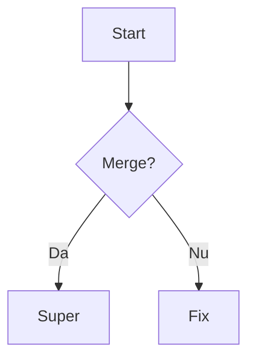

# Welcome 👋

Sample file pentru test reader. Vezi și [docs/guide.md](docs/guide.md).

## Features

- [x] Sidebar tree
- [x] Syntax highlight
- [ ] Task neterminat

### Cod

```js
function hello(name) {
  return `Salut, ${name}!`;
}
```

### Imagine locală


### Math

Inline $E = mc^2$ și bloc:

$$\int_0^\infty e^{-x}\,dx = 1$$

### Diagramă (mermaid)



> Blockquote.

| A | B |
|---|---|
| 1 | 2 |

[Anthropic](https://www.anthropic.com)
