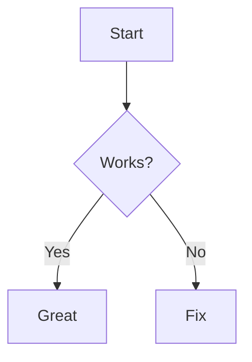

# Welcome 👋

Sample file to test the reader. See also [docs/guide.md](docs/guide.md).

## Features

- [x] Sidebar tree
- [x] Syntax highlight
- [ ] Unfinished task

### Code

```js
function hello(name) {
  return `Hello, ${name}!`;
}
```

### Local image


### Math

Inline $E = mc^2$ and block:

$$\int_0^\infty e^{-x}\,dx = 1$$

### Diagram (mermaid)



> Blockquote.

| A | B |
|---|---|
| 1 | 2 |

[Anthropic](https://www.anthropic.com)
